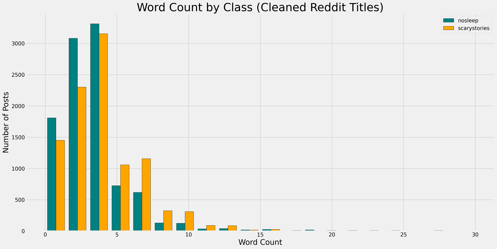

## Technical Report: Subreddit Classification with NLP to Understand Popular Horror Themes
Brittney Hosac 
April 2020

### Problem Statement
As members of Nightmare Publishing, a company that produces horror narratives, it is our mission to release stories that will leave our audiences both capitaved and absolutely terrified.  
- How can this be accomplished? We'll start off by asking, what is it that you’re truly afraid of?  With this knowledge, can we tap into our deepest fears and create a nightmarish novel.

The process will include webscraping, APIs, and Natural Language Processing along with various Classifier Models to determine whether a given post originated from nosleep or scarystories. 

### Data Dictionary
Data was gathered from the following links: 
**nosleep and scarystories subreddits**
- [nosleep](https://www.reddit.com/r/nosleep/)
- [scarystories](https://www.reddit.com/r/scarystories/)

**Cleaning and EDA**
- Raw title text: nosleep subreddit titles are longer by 2 words on average compared to scarystories subreddit titles.(8 word titles versus 6 word titles)
- Cleaned by removing urls, HTML, non-letters, and personalized stopwords in addition to tokenizing and converting text to all lowercase characters.
- Clean meaningful title text: the average title word count dropped by 50% for both subreddits after cleaning. This prompts us to ask, could this be a technique to grab the attention of our audience in a more efficient way?

**EDA and Preprocessing**
- To investigate what the general public discusses most often when it comes to horror, exploring which individual words along with 2 word and 3 word phrases existed in high frequency among both subreddits proved to be extremely telling in relation to our problem statement. These high frequency words are what make up a majority of popular dark fiction themes. 

### Model Summaries
**Logistic Regression and Bayes Classifier models were created and compared in terms of model accuracy and model interpretability in relation to the problem statement.**

- Baseline Model Accuracy = 50.14%
- Established target variable = nosleep subreddit

**A Logistic Regression Classification Model was created using cleaned title text, raw title character count, and raw title word count as the predictive features.**

CountVectorizer Logistic Regression Model Summary Statistics:
- Training Accuracy Score: 93.63%
- Testing Accuracy Score: 72.6%
- Overfit model

Additional Statistics:
- Accuracy: 72.6%
- Misclassification rate: 27.4%
- Recall / Sensitivity: 71.68%
- Specificity: 73.52%
- Precision: 73.13%

**A Multinomial Bayes Classification Model was created using cleaned title text as the predictive feature.**

TFIDFVectorized Multinomial Bayes Model Summary Statistics:
- Training Accuracy Score: 91.04%.
- Testing Accuracy Score: 71.28%.
- Overfit model

**Implementation of Classification models in relation to problem statement:**
- We can use the text that is predictive of nosleep to bring new ideas to creative writing

### Conclusion and Recommendations

**Recommendations for Nightmare Publications** 
- Advertisements and story titles must include shock value and we can accomplish this by decapitating text 'fluff' and focusing on buzz words for future titles.
- Our audience has spoken and it's in our hands to give them what they want. We see major trends in topics such as ouija boards, serial killers, and sleep paralysis in both subreddits: if we kidnap this topic guide, we can build better narrative plots moving forward.  

**Next Steps and Further Exploration**
- Adjust current model: Remove features that aren't contributing to model performance to reduce overfitting.
- Further exploration: Obsessively stalk these subreddits and branch out to other potential victim subreddit threads.
